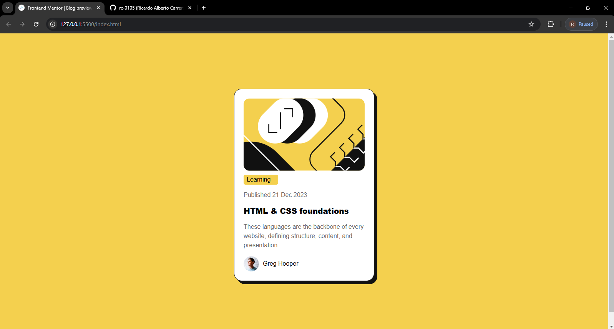

# Frontend Mentor - Blog preview card solution

This is a solution to the [Blog preview card challenge on Frontend Mentor](https://www.frontendmentor.io/challenges/blog-preview-card-ckPaj01IcS). Frontend Mentor challenges help you improve your coding skills by building realistic projects. 

## Table of contents

- [Overview](#overview)
  - [The challenge](#the-challenge)
  - [Screenshot](#screenshot)
  - [Links](#links)
- [My process](#my-process)
  - [Built with](#built-with)
  - [What I learned](#what-i-learned)
  - [Continued development](#continued-development)
- [Author](#author)

## Overview

### The challenge

Users should be able to:

- See hover and focus states for all interactive elements on the page

### Screenshot



### Links

- Solution URL: [https://github.com/rc-0105/Blog-preview-card](https://github.com/rc-0105/Blog-preview-card)
- Live Site URL: [https://rc-0105.github.io/Blog-preview-card/](https://rc-0105.github.io/Blog-preview-card/)

## My process

### Built with

- Semantic HTML5 markup
- CSS custom properties
- Flexbox

### What I learned

In this project i learned how to do hovers and centering elements with flexbox, also setting an inline space in the paragraph in order to people see it in a more confortable way.

I divided my project in the following way using semantic html but also naming all the elements.

```html
 <main class="blog-card">
    <section class="blog-card-content">
      
      <span class="blog-card-label">Learning</span><br>
      <span class="blog-card-date">Published 21 Dec 2023</span><br>
      <a class="blog-card-link" href="#">HTML & CSS foundations</a>
      <p class="blog-card-text">These languages are the backbone of every website, defining structure, content, and presentation.</p>
      <section class="blog-card-author">
        
        <span class="Author-name">Greg Hooper</span>
      </section>
    </section>
  </main>
```

In the css i learned how to add a box shadow property to my boxes, also i learned how to manage multiple elements.
```css
.blog-card-content{
    box-shadow: 8px 8px 0px 0px hsl(0, 0%, 7%);
}

.blog-card-link:hover{
    color: hsl(47, 88%, 63%);
}
```

### Continued development

In future projects ill want to make sure that im structuring the right way mi documents and also aplying the right way on centering and styling components.


## Author

- Website - [Ricardo](https://github.com/rc-0105)
- Frontend Mentor - [@yourusername](https://www.frontendmentor.io/profile/yourusername)
